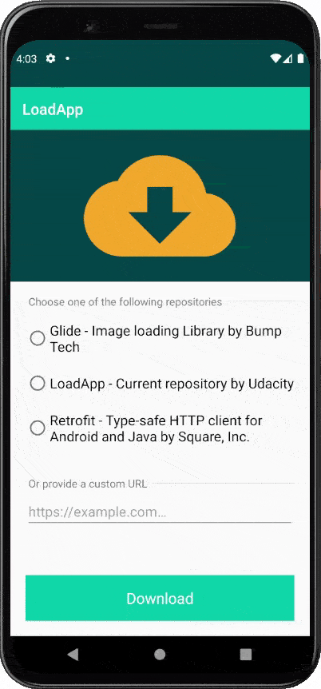
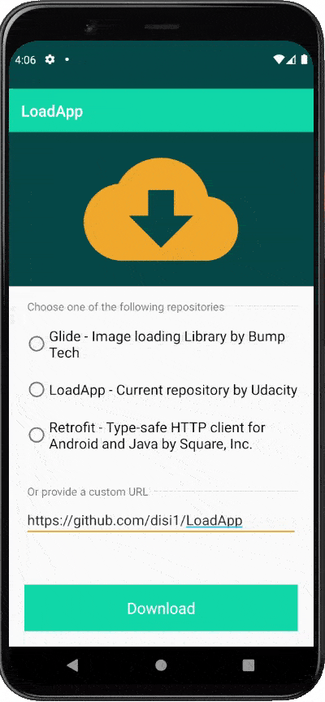

# LoadApp

**LoadApp** is an Android application for **downloading** specific files **from Internet** by clicking on a **custom-built button**

I developed this application as part of the Udacity's [Android Kotlin Developer Nanodegree](https://www.udacity.com/course/android-kotlin-developer-nanodegree--nd940) Program.

LoadApp helps users to download a file from the Internet by clicking on a custom-built button where:
 - width of the button gets animated from left to right;
 - text gets changed based on different states of the button;
 - loading circle is animated from 0 to 360 degrees

A **notification** will be sent once the download is complete. Upon clicking the notification, the user lands on the Detail activity and the notification gets dismissed. In Detail activity, the status of the download will be displayed and animated via **MotionLayout** upon opening the activity.

## Application flow
Take a look at the things you can do with this app:

## Built With

* [Android Studio](https://developer.android.com/studio)
* [Kotlin](https://kotlinlang.org/)

## Get in touch
Reach out at [diana.sica29@gmail.com](mailto:diana.sica29@gmail.com)
